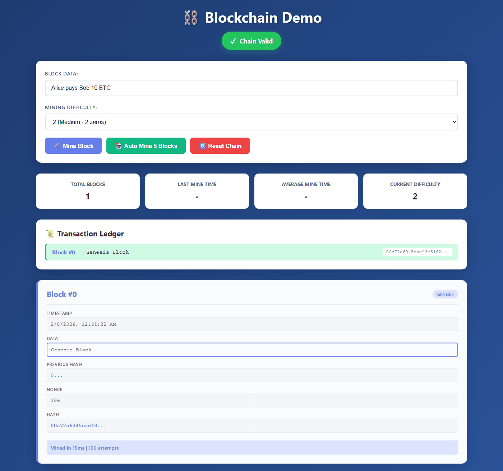
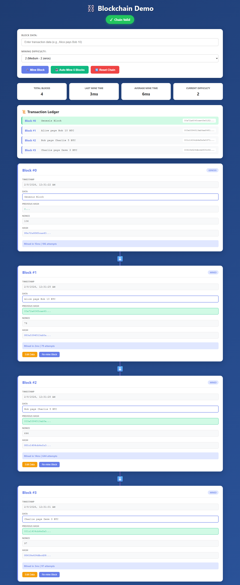

# ⛓️ Blockchain Visualizer

A visual, interactive web application demonstrating how blockchain technology works. Built for the Cryptography & Blockchain course.



*Animated demo showing blockchain mining, tampering detection, and auto re-mining*



## 🎯 Features

### Core Requirements (100 points)

1. **📦 Display the Blockchain**
   - Each block shows: Block Number, Timestamp, Data, Previous Hash, Nonce, Hash
   - Visual linking with color coding (green = hash matches, red = mismatch)
   - Chain validation indicator (green = valid, red = invalid)

2. **⛏️ Mining Feature**
   - Input field for block data
   - "Mine Block" button with loading spinner
   - Displays mining time (e.g., "Mined in 45ms")
   - Uses Proof-of-Work algorithm

3. **✅ Validation Indicator**
   - Large, clear indicator showing "Chain Valid" (green) or "Chain Invalid" (red)
   - Updates automatically when blocks are added or edited
   - Shake animation when chain becomes invalid

4. **⚙️ Difficulty Selector**
   - Choose difficulty level 1-4 (number of leading zeros required)
   - Higher difficulty = longer mining time
   - Visual feedback on current difficulty

### Bonus Features (+5 extra points)

5. **🎭 Tampering Demo**
   - Edit button on each block to change data
   - Chain becomes invalid when tampered (red border)
   - Re-mine button to fix the chain

6. **🤖 Auto-Mine Feature**
   - Button to automatically mine 5 blocks at once
   - Shows progress as each block is mined

7. **📊 Mining Statistics**
   - Total blocks mined
   - Last mining time
   - Average mining time across all blocks

8. **📜 Transaction Ledger View**
   - Visual chain showing all transactions in order
   - Clear linking between blocks

## 🚀 How to Run Locally

### Prerequisites
- [Node.js](https://nodejs.org/) (v14 or higher)
- npm (comes with Node.js)

### Installation & Running

```bash
# 1. Clone the repository
git clone https://github.com/DiademGraceArroz/blockchain-demo.git
cd blockchain-demo

# 2. Install dependencies
npm install

# 3. Run the development server
npm run dev
```

The app will open at `http://localhost:5173` (or another port if 5173 is busy)

### Building for Production

```bash
npm run build
```

The built files will be in the `dist/` folder.

## 🛠️ Tech Stack

- **Frontend:** Vanilla HTML5, CSS3, JavaScript (ES6+)
- **Build Tool:** Vite
- **Hashing:** crypto-js (SHA-256)
- **Styling:** Custom CSS with animations

## 📖 How to Use

1. **Mine a Block:**
   - Enter transaction data in the input field
   - Select desired difficulty (1-4)
   - Click "⛏️ Mine Block"
   - Watch the mining process and see the new block added

2. **Tamper with a Block:**
   - Click "✏️ Edit Data" on any non-genesis block
   - Modify the data
   - Watch the chain become invalid (red indicator)

3. **Fix the Chain:**
   - Click "⛏️ Re-mine" on the tampered block
   - All subsequent blocks will be re-mined automatically
   - Chain becomes valid again

4. **Auto-Mine:**
   - Click "🤖 Auto Mine 5 Blocks" to quickly populate the chain

5. **Reset:**
   - Click "🔄 Reset Chain" to start fresh

## 🎓 Learning Objectives

This project demonstrates:
- How blocks link together through hashes
- Proof-of-Work mining concept
- How tampering breaks the chain
- How validation detects tampering
- Difficulty adjustment and its effect on mining time

## 📁 Project Structure

```
blockchain-demo/
├── index.html          # Main HTML file
├── package.json        # Dependencies and scripts
├── README.md          # This file
├── src/
│   ├── blockchain.js  # Blockchain logic (Block & Blockchain classes)
│   ├── main.js        # UI interactions and rendering
│   └── style.css      # Styling and animations
```

## 📝 Assignment Details

- **Course:** Cryptography & Blockchain
- **Assignment:** Week 2 - Blockchain Visualizer
- **Due:** Before Week 3 class (February 11, 2026)
- **Points:** 100 (+5 bonus)

## 🔗 Live Demo

🚀 **[View Live Demo](https://blockchain-demo-one.vercel.app/)** - Deployed on Vercel

## 📄 License

ISC

---

Made with ❤️ for learning blockchain technology!
